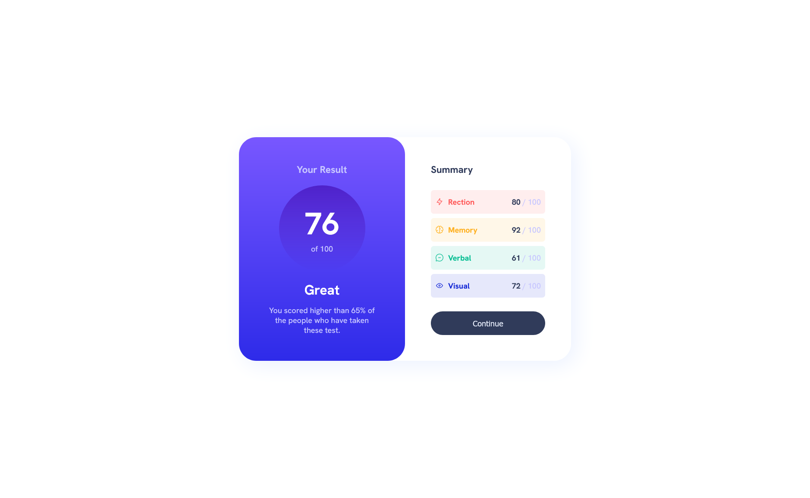
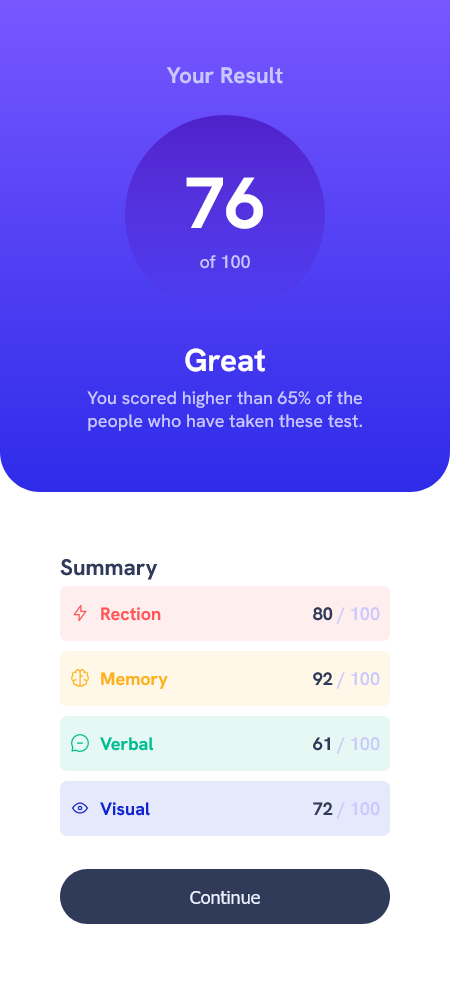

# Frontend Mentor - Results summary component solution

This is a solution to the [Results summary component challenge on Frontend Mentor](https://www.frontendmentor.io/challenges/results-summary-component-CE_K6s0maV). Frontend Mentor challenges help you improve your coding skills by building realistic projects. 

## Table of contents

- [Overview](#overview)
  - [The challenge](#the-challenge)
  - [Screenshot](#screenshot)
  - [Links](#links)
- [My process](#my-process)
  - [Built with](#built-with)
  - [What I learned](#what-i-learned)
  - [Useful resources](#useful-resources)
- [Author](#author)

## Overview

### The challenge

Users should be able to:

- View the optimal layout for the interface depending on their device's screen size
- See hover and focus states for all interactive elements on the page

### Screenshot

Desktop View

Mobile View

### Links

- Solution URL: [Add solution URL here](https://github.com/jsngzm/Results-summary-component)
- Live Site URL: [Add live site URL here](https://your-live-site-url.com)

## My process

### Built with

- HTML
- CSS
- FlexBox
- Grid

### What I learned

While working on this project, I became more comfortable using Flex and Grid. Now that I have a better understanding of these CSS tools, I can start to clean up my code.

### Useful resources

- [MDN](https://developer.mozilla.org/en-US/) - When I became stuck or didn't fully understand something I used the MDN to figure it out.

## Author

- Website - [Jason Guzman](https://github.com/jsngzm)
- Frontend Mentor - [@jsngzm](https://www.frontendmentor.io/profile/jsngzm)
